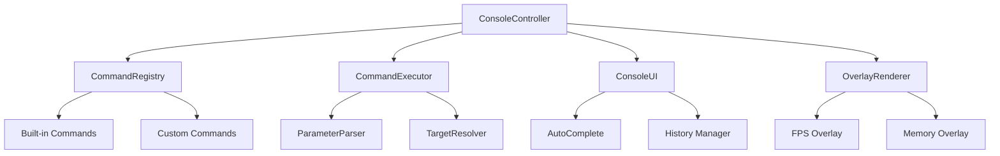

# 🎮 Commander

<div align="center">


**Sistema de Console de Comandos Avançado para Unity**

*Console de desenvolvimento poderoso e extensível com autocompletar, histórico e overlays visuais*

[📥 Instalação](#-instalação) • [🚀 Início Rápido](#-início-rápido) • [📖 Documentação](#-documentação) • [🎯 Exemplos](#-exemplos)

</div>

---

## ✨ Características

### 🎯 **Core Features**
- ⌨️ **Autocomplete inteligente** com TAB
- 📈 **Histórico de comandos** com navegação por setas
- 🔍 **Sistema de busca** de objetos na cena
- 🎨 **Overlays visuais** para FPS, memória e debug

### 🛠️ **Sistema de Comandos**
- 🔌 **Comandos customizados** via atributos
- 🎯 **Resolução automática** de alvos
- 📝 **Parser inteligente** de parâmetros
- 🏷️ **Categorização** automática
- 💡 **Sugestões contextuais** de comandos

### 🔧 **Funcionalidades Avançadas**
- 🔐 **Autenticação de desenvolvedor** em builds
- 📊 **Logs estruturados** com níveis
- 🎬 **Animações e transições** suaves
- 🖱️ **Scroll com mouse** e navegação por teclado
- 🎨 **Interface customizável** e responsiva

---

## 📥 Instalação

### Via Package Manager (Recomendado)

1. Abra o **Package Manager** (`Window > Package Manager`)
2. Clique no botão **`+`** no canto superior esquerdo
3. Selecione **"Add package from git URL..."**
4. Digite a URL:
   ```
   https://github.com/Natteens/commander.git
   ```
5. Clique em **Add**

### Via manifest.json

Adicione ao arquivo `Packages/manifest.json`:

```json
{
  "dependencies": {
    "com.natteens.commander": "https://github.com/Natteens/commander.git"
  }
}
```

---

## 🚀 Início Rápido

### 1. Setup Básico

```csharp
// O Commander é configurado automaticamente!
// Apenas adicione o ConsoleController à sua cena
```

### 2. Abrir Console

- **F1** - Alternar console
- **Ctrl+Shift+F12** - Autenticação de desenvolvedor (builds)

### 3. Comandos Básicos

```bash
help                    # Lista todos os comandos
list                    # Mostra objetos na cena
fps                     # Toggle overlay de FPS
memory                  # Info de memória
time 0.5               # Câmera lenta
clear                   # Limpa o console
```

---

## 📖 Documentação

### 🎮 Controles de Runtime

| Tecla | Ação |
|-------|------|
| `F1` | Alternar console |
| `TAB` | Autocompletar |
| `↑↓` | Histórico de comandos |
| `Page Up/Down` | Scroll do log |
| `Mouse Wheel` | Scroll do log |
| `Ctrl+Shift+F12` | Auth de desenvolvedor |

### 🛠️ Criando Comandos Customizados

#### Comando Simples

```csharp
using Commander;
using UnityEngine;

public class PlayerController : MonoBehaviour
{
    [Command("heal", "Cura o jogador")]
    public void HealPlayer(float amount = 50f)
    {
        // Sua lógica aqui
        health += amount;
        ConsoleController.Log($"Curado! Vida: {health}", CommandStatus.Success);
    }
}
```

#### Comando com Múltiplos Parâmetros

```csharp
[Command("teleport", "Teleporta o jogador", Category = "Movement")]
public void TeleportPlayer(Vector3 position)
{
    transform.position = position;
    ConsoleController.Log($"Teleportado para {position}", CommandStatus.Success);
}

// Uso: teleport 10 5 20
```

#### Comando Estático para Objetos

```csharp
[Command("setcolor", "Altera cor do objeto")]
public static void SetObjectColor(string objectName, Color color)
{
    GameObject target = GameObject.Find(objectName);
    if (target?.GetComponent<Renderer>() != null)
    {
        target.GetComponent<Renderer>().material.color = color;
        ConsoleController.Log($"Cor alterada para {color}", CommandStatus.Success);
    }
}

// Uso: setcolor Player red
// Uso: setcolor Player #FF0000
```

### 🎨 Comandos Implementados por Classe

```csharp
using Commander.Commands;

public class CustomCommand : ICommand
{
    public string Name => "custom";
    public string Description => "Meu comando customizado";
    public string Category => "Game";
    public Type[] ParameterTypes => new[] { typeof(string), typeof(int) };
    
    public bool Execute(object target, params object[] parameters)
    {
        var text = (string)parameters[0];
        var number = (int)parameters[1];
        
        ConsoleController.Log($"Executando: {text} com {number}", CommandStatus.Success);
        return true;
    }
    
    public bool CanExecute(object target) => true;
}

// Registrar manualmente:
// commandRegistry.Register(new CustomCommand());
```

---

## 🎯 Exemplos

### 🎮 Sistema de Movimento

```csharp
public class MovementController : MonoBehaviour
{
    [Command("speed", "Define velocidade do jogador")]
    public void SetSpeed(float speed)
    {
        moveSpeed = Mathf.Clamp(speed, 0f, 50f);
        ConsoleController.Log($"Velocidade: {moveSpeed}", CommandStatus.Success);
    }
    
    [Command("jump", "Faz o jogador pular")]
    public void Jump(float force = 10f)
    {
        GetComponent<Rigidbody>().AddForce(Vector3.up * force, ForceMode.Impulse);
        ConsoleController.Log("Pulando!", CommandStatus.Info);
    }
    
    [Command("noclip", "Toggle modo fantasma")]
    public void ToggleNoClip()
    {
        var collider = GetComponent<Collider>();
        collider.enabled = !collider.enabled;
        
        string status = collider.enabled ? "OFF" : "ON";
        ConsoleController.Log($"NoClip: {status}", CommandStatus.Warning);
    }
}
```

### 🎨 Sistema de Ambiente

```csharp
public class EnvironmentController : MonoBehaviour
{
    [Command("fog", "Controla neblina")]
    public static void SetFog(bool enabled, float density = 0.01f)
    {
        RenderSettings.fog = enabled;
        RenderSettings.fogDensity = density;
        
        ConsoleController.Log($"Fog: {(enabled ? "ON" : "OFF")}", CommandStatus.Info);
    }
    
    [Command("skybox", "Troca skybox")]
    public static void ChangeSkybox(string skyboxName)
    {
        var skybox = Resources.Load<Material>($"Skyboxes/{skyboxName}");
        if (skybox != null)
        {
            RenderSettings.skybox = skybox;
            ConsoleController.Log($"Skybox alterado: {skyboxName}", CommandStatus.Success);
        }
        else
        {
            ConsoleController.Log($"Skybox não encontrado: {skyboxName}", CommandStatus.Error);
        }
    }
    
    [Command("weather", "Define clima")]
    public static void SetWeather(string weather)
    {
        switch(weather.ToLower())
        {
            case "rain":
                // Ativa chuva
                ConsoleController.Log("☔ Chuva ativada", CommandStatus.Info);
                break;
            case "snow":
                // Ativa neve
                ConsoleController.Log("❄️ Neve ativada", CommandStatus.Info);
                break;
            case "clear":
                // Limpa tempo
                ConsoleController.Log("☀️ Tempo limpo", CommandStatus.Success);
                break;
            default:
                ConsoleController.Log($"Clima desconhecido: {weather}", CommandStatus.Error);
                break;
        }
    }
}
```

### 🛠️ Sistema de Debug

```csharp
public class DebugController : MonoBehaviour
{
    [Command("wireframe", "Toggle modo wireframe")]
    public static void ToggleWireframe()
    {
        var cameras = Camera.allCameras;
        foreach (var cam in cameras)
        {
            cam.GetComponent<Camera>().renderingPath = 
                cam.renderingPath == RenderingPath.UsePlayerSettings 
                    ? RenderingPath.Forward 
                    : RenderingPath.UsePlayerSettings;
        }
        
        ConsoleController.Log("Wireframe toggled", CommandStatus.Info);
    }
    
    [Command("screenshot", "Captura screenshot")]
    public static void TakeScreenshot(string filename = "")
    {
        if (string.IsNullOrEmpty(filename))
            filename = $"screenshot_{DateTime.Now:yyyyMMdd_HHmmss}.png";
            
        ScreenCapture.CaptureScreenshot(filename);
        ConsoleController.Log($"Screenshot salvo: {filename}", CommandStatus.Success);
    }
    
    [Command("profile", "Info de performance")]
    public static void ShowProfileInfo()
    {
        ConsoleController.Log("=== PERFORMANCE INFO ===", CommandStatus.Info);
        ConsoleController.Log($"FPS: {1f/Time.unscaledDeltaTime:F1}", CommandStatus.Info);
        ConsoleController.Log($"Frame Time: {Time.unscaledDeltaTime*1000f:F1}ms", CommandStatus.Info);
        ConsoleController.Log($"Memory: {GC.GetTotalMemory(false)/1024/1024}MB", CommandStatus.Info);
        ConsoleController.Log($"Draw Calls: {UnityStats.drawCalls}", CommandStatus.Info);
    }
}
```

---

## ⚙️ Configuração

### ConsoleController Settings

```csharp
[Header("Configuration")]
public KeyCode toggleKey = KeyCode.F1;           // Tecla para abrir
public string developerKey = "DEV_2024";         // Chave de autenticação
public bool enableInEditor = true;               // Ativo no editor

[Header("Debug Settings")]
public bool showDebugLogs = false;               // Logs no Unity Console
```

### UI Customization

```csharp
// Personalizar cores e estilos
var config = new ConsoleUIConfig
{
    backgroundColor = Color.black,
    textColor = Color.white,
    fontSize = 12
};

consoleController.SetUIConfig(config);
```

---

## 🔧 API Reference

### Core Classes

| Classe | Descrição |
|--------|-----------|
| `ConsoleController` | Controlador principal do console |
| `ConsoleUI` | Interface gráfica do console |
| `CommandRegistry` | Registro de comandos |
| `CommandExecutor` | Executor de comandos |
| `ParameterParser` | Parser de parâmetros |

### Principais Métodos

```csharp
// Logging
ConsoleController.Log("Mensagem", CommandStatus.Success);
ConsoleController.LogDebug("Debug info", CommandStatus.Info);

// Execução
ConsoleController.ExecuteCommand("help");

// Registro manual
var registry = consoleController.GetCommandRegistry();
registry.Register(new MyCustomCommand());
```

### Tipos de Parâmetros Suportados

- `string` - Texto simples ou "entre aspas"
- `int` - Números inteiros
- `float` - Números decimais (. ou ,)
- `bool` - true/false, 1/0, on/off
- `Vector3` - Coordenadas x,y,z ou (x,y,z)
- `Vector2` - Coordenadas x,y
- `Color` - red, #FF0000, (255,0,0)

---

## 🏗️ Arquitetura



---

<div align="center">

**Feito com ❤️ por [Nathan Silva Miranda](https://github.com/Natteens)**

[⭐ Star no GitHub](https://github.com/Natteens/commander) • [🐛 Reportar Bug](https://github.com/Natteens/commander/issues) • [💡 Sugerir Feature](https://github.com/Natteens/commander/issues)

</div>
